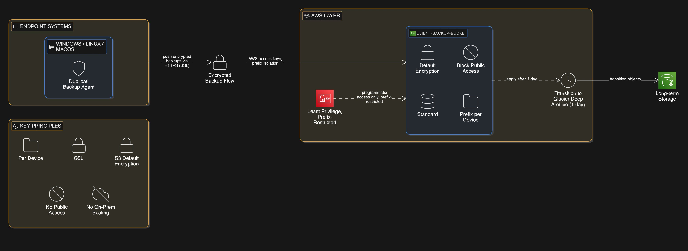

# AWS S3 + Glacier Deep Archive Backup Architecture

Client: American Academy of Financial Management India  
Solution: Automated Encrypted Multi-Device Backup  
Tool: Duplicati  
Cloud Platform: Amazon Web Services (AWS)

---

## Project Objective

Design and implement a secure, automated, scalable, and cost-optimized cloud backup solution with:

- Encrypted backups
- Multi-device support
- Long-term archival storage
- Automated lifecycle management
- Least-privilege IAM access
- Zero public exposure

---

## Architecture Overview

### Logical Flow

Endpoint Systems (Windows / Linux / macOS)  
→ Duplicati Backup Agent  
→ Amazon S3 (Standard Storage)  
→ Lifecycle Rule  
→ Glacier Deep Archive  

---

## Security Controls

- IAM least-privilege access (prefix-restricted)
- Programmatic access only (no console login)
- S3 Block Public Access enabled
- Server-side encryption enabled
- SSL/TLS encrypted transmission
- Per-device prefix isolation

---

## Storage Strategy

### S3 Standard
- Initial backup ingestion
- Active restore capability

### Glacier Deep Archive
- Automatic transition after 1 day
- Ultra-low-cost long-term retention
- 12–48 hour retrieval window

---

## Retention Strategy (Duplicati)

7D:1D,4W:1W,12M:1M

- Daily backups for 7 days
- Weekly backups for 4 weeks
- Monthly backups for 12 months

---

## Key Design Decisions

- Lifecycle-based archive transition instead of direct Deep Archive write
- Prefix isolation per device
- IAM group-based access control
- No on-prem storage scaling
- Minimal operational overhead

---

## Operational Model

- Backup scheduling handled by Duplicati
- Restore validation tested
- IAM key rotation recommended
- Lifecycle transition verified post-deployment

---

## Outcome

The solution delivers:

- Encrypted automated backups
- Centralized cloud storage
- Cost-optimized long-term archival
- Multi-device scalability
- Production-grade security controls

---

Author: Avinash Singh  
Cloud Architecture | AWS Infrastructure | Cost Optimization
